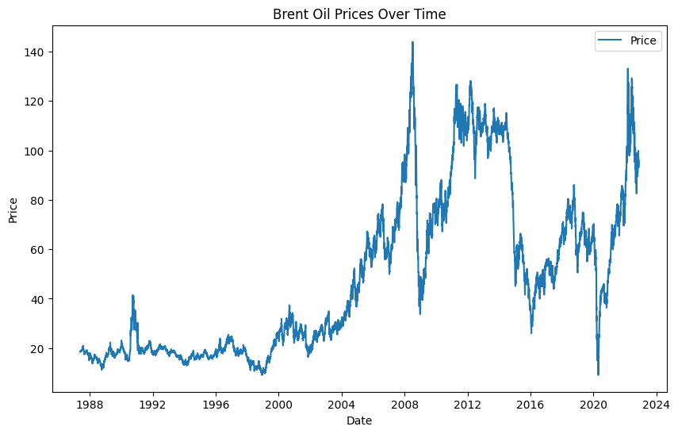
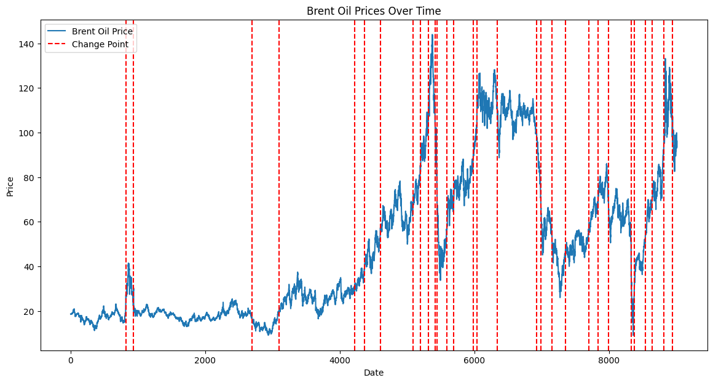
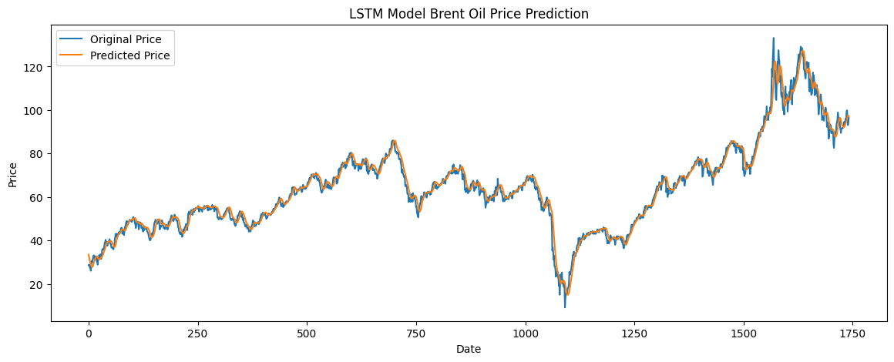
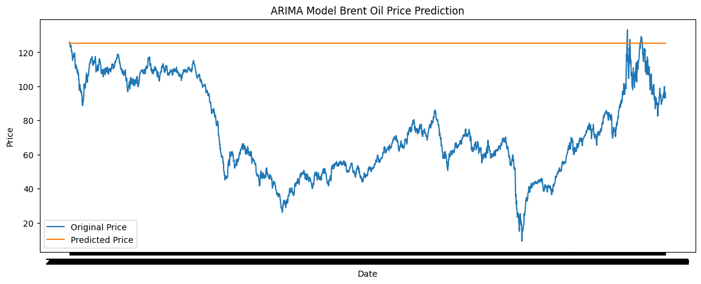
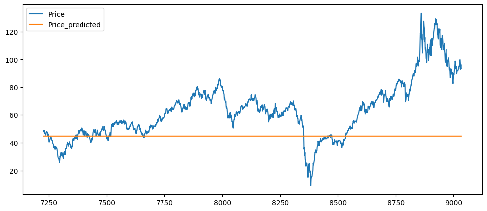

# Brent Oil Price Change Point Analysis
This repository provides an in-depth analysis of Brent oil price fluctuations and significant change points, focusing on the impact of geopolitical events, economic shifts, and policy decisions on global oil markets. The analysis leverages time series modeling and change-point detection techniques to identify periods of substantial change in oil prices, aiding in understanding the factors influencing these shifts.

## Table of Contents
- [Project Overview](#project-overview)
- [Key Components](#key-components)
- [Project Structure](#project-structure)
- [Results](#Results)
- [Installation](#installation)
- [Data Pipeline](#data-pipeline)
- [Usage](#usage)
- [Contributing](#contributing)
- [License](#license)

## Project Overview
**The Brent Oil Price Change Point Analysis** project examines historical Brent oil prices to detect points of abrupt changes and trends. Using methods such as ARIMA, GARCH, and change-point detection algorithms, the project identifies key periods affected by external factors and interprets how events like wars, economic crises, and policy adjustments impact oil price dynamics.

Key objectives include:

Identifying and visualizing significant change points in Brent oil price history.
Analyzing the relationship between historical events and price fluctuations.
Providing insights into the factors driving oil market volatility.

## Key Components

- **Time Series Analysis**: Uses models like ARIMA and GARCH to model and forecast oil price trends.
Change Point Detection: Applies libraries such as ruptures and pymc3 to identify and visualize abrupt changes in the time series data.

- **Event-Based Analysis**: Associates detected change points with major historical events to explain underlying causes.
**Modelling and Prediction** : historical price data is used to predict future price.

## Project Structure
├── .github.<br>
│   └── workflow<br>
│       └── test.yaml<br>
├── .venv <br>
├── .vscode<br>
│   └── settings.json<br>
├── DashBoard<br>
│   └── Flask_API<br>
│   |    └── image<br>
│   |    └── public<br>
│   |    └── api,py<br>
├───|              
│   └── React_Front_End<br>
│       └── public<br>
│       └── src<br>
│       └── index.html<br>
│       └── package.json<br>
├── notebook<br>
│   ├── ARIMA_model.ipynb<br>
│   ├── change_point_analysis.ipynb<br>
│   ├── LSTM_Model.ipynb<br>
│   ├── preprocessing and EDA.ipynb><br>
│   ├──statistical_and_econometric_model.ipynb<br>
│
├──script<br>
|   ├──ARIMA_modelling.py<br>
|   ├──change_point_analysis.py<br>
|   ├──LSTM_modelling.py<br>
│   ├─preprocessing_and_EDA.py<br>
│   
├── .gitignore<br>
├──  README.MD<br>
├──  requirements.txt <br>
## Results





## Installation

1. **Clone the repository**:
   ```bash
   git clone https://github.com/wolderufael/Brent_Oil_Price_Change_point_Analysis.git
   cd Brent_Oil_Price_Changepoint_Analysis
2. **Set up Python environment**: Create a virtual environment and activate it:
   ```bash
    python -m venv .venv
    source .venv/bin/activate  # For Linux/macOS
    .venv\Scripts\activate  # For Windows

2. **Install the required packages**: Install the dependencies from the `requirements.txt` file:
   ```bash
    pip install -r requirements.txt

## Contributing
Contributions to improve this project are welcome. If you'd like to contribute, please fork the repository and submit a pull request.

## License
This project is licensed under the MIT License. See the LICENSE file for details.
